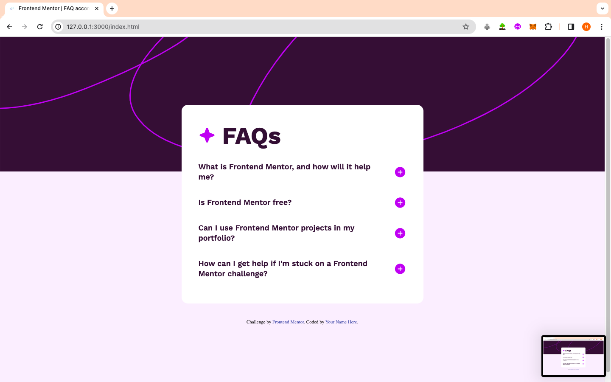

# Frontend Mentor - FAQ accordion solution

This is a solution to the [FAQ accordion challenge on Frontend Mentor](https://www.frontendmentor.io/challenges/faq-accordion-wyfFdeBwBz). Frontend Mentor challenges help you improve your coding skills by building realistic projects.

## Table of contents

- [Overview](#overview)
  - [Screenshot](#screenshot)
  - [Links](#links)
  - [Built with](#built-with)
  - [What I learned](#what-i-learned)
  - [Useful resources](#useful-resources)
- [Author](#author)

## Overview

Building a FAQ accordion

### The challenge

Users should be able to:

- Hide/Show the answer to a question when the question is clicked
- Navigate the questions and hide/show answers using keyboard navigation alone
- View the optimal layout for the interface depending on their device's screen size
- See hover and focus states for all interactive elements on the page

### Screenshot

### Links

- Solution URL: [Add solution URL here](https://your-solution-url.com)
- Live Site URL: [Add live site URL here](https://your-live-site-url.com)

### Built with

- Semantic HTML5 markup
- CSS custom properties
- Flexbox
- CSS Grid
- Mobile-first workflow
- JavaScript
- jQuery

Major learnings from this project :

- Flexbox - A very powerful feature of CSS , which helps in to align content along 1 dimensional line.
- Responsiveness provided by Flexbox (flex-shrink) - Astonishing property of flexbox whuch helps in to create responsive website across all the devices.
- Grid - The Component part was build using CSS Grid as it allows designers and developers to precisely control the placement and sizing of elements within both rows and columns.
- jQuery - Learning jQuery was very needful as it helps in to compress large javascript code into few lines.
  It is compatible with almost every browser in the market.
  Helps in to handle complex tasks such as animations.

### Useful resources

- [jQuery Documentation](https://api.jquery.com) - Official Documentation for jQuery
- [W3 Schools](https://www.w3schools.com/js/default.asp) - Great Tutorial for javascript

## Author

- Website - [Harsh Khandelwal]()
- Frontend Mentor - [@yourusername](https://www.frontendmentor.io/profile/harsh-kh08)
- Twitter - [@yourusername](https://twitter.com/HarshOnXApp)
