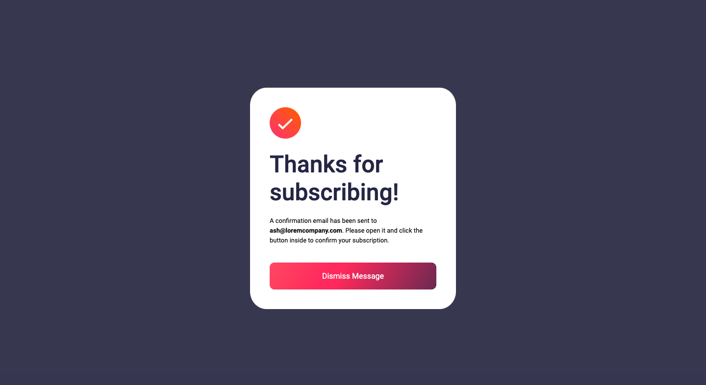

# Frontend Mentor - Newsletter sign-up form with success message solution

This is a solution to the [Newsletter sign-up form with success message challenge on Frontend Mentor](https://www.frontendmentor.io/challenges/newsletter-signup-form-with-success-message-3FC1AZbNrv). Frontend Mentor challenges help you improve your coding skills by building realistic projects.

## Table of contents

- [Overview](#overview)
  - [Screenshot](#screenshot)
  - [Links](#links)
  - [Built with](#built-with)
  - [What I learned](#what-i-learned)
  - [Useful resources](#useful-resources)
- [Author](#author)

## Overview

Building a Newsletter sign-up form with success message challenge

### The challenge

Users should be able to:

- Add their email and submit the form
- See a success message with their email after successfully submitting the form
- See form validation messages if:
  - The field is left empty
  - The email address is not formatted correctly
- View the optimal layout for the interface depending on their device's screen size
- See hover and focus states for all interactive elements on the page

### Screenshot




### Links

- Solution URL: [Solution Link](https://github.com/harsh-kh08/FrontendMentorChallenges/tree/master/newsletter-sign-up-with-success-message-main)
- Live Site URL: [Live Link](https://frontend-mentor-challenges-harsh-kh08-newsletter-signup.vercel.app/)

### Built with

- Semantic HTML5 markup
- CSS custom properties
- Flexbox
- CSS Grid
- Mobile-first workflow

### What I learned

I have learned how to test emal using RegEx expression and worked on Advanced CSS properties.

To see how you can add code snippets, see below:

```js
const regex_pattern =
  /^(([^<>()[\]\\.,;:\s@\"]+(\.[^<>()[\]\\.,;:\s@\"]+)*)|(\".+\"))@((\[[0-9]{1,3}\.[0-9]{1,3}\.[0-9]{1,3}\.[0-9]{1,3}\])|(([a-zA-Z\-0-9]+\.)+[a-zA-Z]{2,}))$/;
```

### Useful resources

- [MDN Docs](https://developer.mozilla.org/en-US/) - A highly reputable and comprehensive resource for learning HTML5,CSS.
- [CSS-Tricks](https://css-tricks.com/snippets/css/a-guide-to-flexbox/) - A valuable resource for learning about flexbox.
- [W3Schools] - Great Tutorial and Reference for Javascript and jQuery

## Author

- Website - [Website Link](https://frontend-mentor-challenges-harsh-kh08-newsletter-signup.vercel.app)
- Frontend Mentor - [@harsh-kh08](https://www.frontendmentor.io/profile/harsh-kh08)
- Twitter - [@HarshOnXApp](https://twitter.com/HarshOnXApp)
