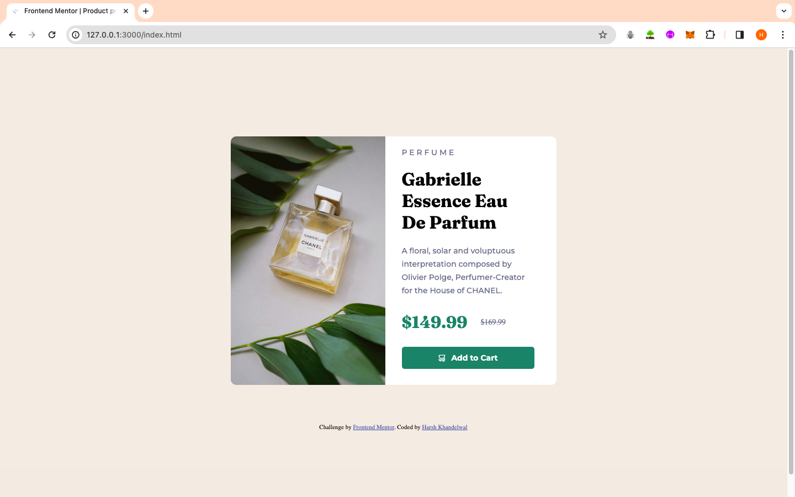

# Frontend Mentor - Product preview card component solution

This is a solution to the [Product preview card component challenge on Frontend Mentor](https://www.frontendmentor.io/challenges/product-preview-card-component-GO7UmttRfa). Frontend Mentor challenges help you improve your coding skills by building realistic projects.

## Table of contents

- [Overview](#overview)
  - [Screenshot](#screenshot)
  - [Links](#links)
  - [Built with](#built-with)
  - [What I learned](#what-i-learned)
  - [Useful resources](#useful-resources)
- [Author](#author)

## Overview

Building a Product preview card component

### Screenshot



### Links

- Solution URL: [Repository Link](https://github.com/harsh-kh08/FrontendMentorChallenges/tree/master/product-preview-card-component-main)
- Live Site URL: [Live Link](https://productviewcard-harsh-kh08.vercel.app)

### Built with

- Semantic HTML5 markup
- CSS custom properties
- Flexbox
- CSS Grid
- Mobile-first workflow

### What I learned

Major learnings from this project :

- Flexbox - A very powerful feature of CSS , which helps in to align content along 1 dimensional line.
- Responsiveness provided by Flexbox (flex-shrink) - Astonishing property of flexbox whuch helps in to create responsive website across all the devices.
- Grid - The Component part was build using CSS Grid as it allows designers and developers to precisely control the placement and sizing of elements within both rows and columns.

To see how you can add code snippets, see below:

```css
body {
  display: flex;
  flex-direction: column;
  justify-content: center;
  align-items: center;
  height: 100vh;
  margin: 0px;
  background-color: hsl(30, 38%, 92%);
  margin: 20px;
}

.container {
  display: grid;
  grid-template-columns: minmax(auto, 280px) minmax(auto, 280px);
  grid-template-rows: auto;
  text-align: left;
  gap: 30px;
  border-radius: 10px;
  background-color: hsl(0, 0%, 100%);
}
```

### Useful resources

- [MDN Docs](https://developer.mozilla.org/en-US/) - A highly reputable and comprehensive resource for learning HTML5,CSS.
- [CSS-Tricks](https://css-tricks.com/snippets/css/a-guide-to-flexbox/) - A valuable resource for learning about flexbox.

## Author


- Frontend Mentor - [@harsh-kh08](https://www.frontendmentor.io/profile/harsh-kh08)
- Twitter - [@HarshOnXApp](https://twitter.com/HarshOnXApp)
