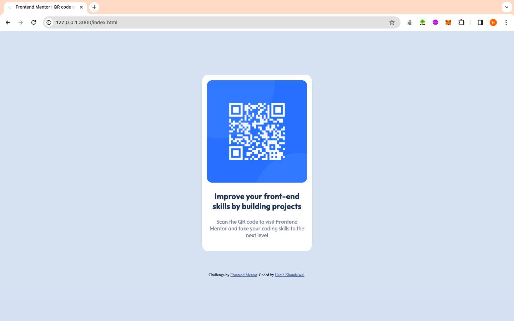

# Frontend Mentor - QR code component solution

This is a solution to the [QR code component challenge on Frontend Mentor](https://www.frontendmentor.io/challenges/qr-code-component-iux_sIO_H). Frontend Mentor challenges help you improve your coding skills by building realistic projects.

## Table of contents

- [Overview](#overview)
  - [Screenshot](#screenshot)
  - [Links](#links)
  - [Built with](#built-with)
  - [What I learned](#what-i-learned)
  - [Continued development](#continued-development)
  - [Useful resources](#useful-resources)
- [Author](#author)
- [Acknowledgments](#acknowledgments)

## Overview

Building A QR Code Component using HTML and CSS

### Screenshot



### Links

- Solution URL: [Add solution URL here](https://your-solution-url.com)
- Live Site URL: [Add live site URL here](https://your-live-site-url.com)

### Built with

- Semantic HTML5 markup
- CSS custom properties
- Flexbox

### What I learned

Major learnings from this project :

- Flexbox - A very powerful feature of CSS , which helps in to align content along 1 dimensional line.
- Responsiveness provided by Flexbox (flex-shrink) - Astonishing property of flexbox whuch helps in to create responsive website across all the devices.

Following Code Snippet below ->

```css
body {
  height: 100vh;
  display: flex;
  flex-direction: column;
  justify-content: center;
  align-items: center;
  margin: 0px;
  background-color: hsl(212, 45%, 89%);
}

.qr-container {
  text-align: center;
  background-color: hsl(0, 0%, 100%);
  max-width: 280px;
  flex-shrink: 1;
  padding: 15px;
  border-radius: 5%;
  margin-bottom: 60px;
}
```

### Continued development

Want to eludicate a salient conceptual difference betwen Flexbox and Grid -

Flexbox serves as a pivotal tool for crafting singular dimesnsional layouts , whereas Grid , with its inherent versatility, extends its mastery over the realm of two-dimensional arrangements.

It's imperative to recognize that a direct comparision between these two powerhouses is inherently futile, as they cater to different use cases.

It's not about which is better; it's about picking the right tool for the layout you're aiming for.

### Useful resources

- [MDN Docs](https://developer.mozilla.org/en-US/) - A highly reputable and comprehensive resource for learning HTML5,CSS.
- [CSS-Tricks](https://css-tricks.com/snippets/css/a-guide-to-flexbox/) - A valuable resource for learning about flexbox.

## Author

- Website - [Add your name here](https://www.your-site.com)
- Frontend Mentor - [@harsh-kh08](https://www.frontendmentor.io/profile/harsh-kh08)
- Twitter - [@HarshOnXApp](https://twitter.com/HarshOnXApp)
